# AdTech Real-Time Event Tracking Pipeline

This project implements a scalable, production-grade, real-time event tracking pipeline on Google Cloud Platform. It is designed to handle high-volume event ingestion, processing, and analytics for AdTech applications.

## 🚀 Project Overview

This pipeline is designed to address the challenges of tracking and analyzing millions of daily events from various sources, such as website pixels, server-side webhooks, and third-party advertising platforms like Meta and Google Ads.

### Key Features:
- **Cloud-Native & Serverless:** Built entirely on GCP, leveraging serverless components like Cloud Run and Cloud Functions for scalability and cost-efficiency.
- **Real-Time Processing:** Events are processed and made available for analytics in near real-time.
- **Scalable & Decoupled:** The architecture is designed to handle high throughput and is decoupled using Pub/Sub to ensure reliability.
- **Infrastructure as Code:** All infrastructure is managed using Terraform for reproducibility and version control.
- **CI/CD Automation:** Deployment is fully automated with GitHub Actions.
- **Modular Data Modeling:** Data transformations are managed with dbt for maintainability and data quality.

## 📐 System Architecture

```mermaid
graph TD
    subgraph "Data Sources"
        A["🛒 Pixel/Webhook"]
        B["META Meta Ads API"]
        C["GOOG Google Ads API"]
    end

    subgraph "Ingestion & Storage"
        D["☁️ Cloud Run API"] --> E["✉️ Pub/Sub"]
        E --> F["🗄️ GCS Raw Lake"]
        E --> G["🗄️ ClickHouse Raw"]
        H["✈️ Airbyte"] --> G
        B --> H
        C --> H
    end

    subgraph "Processing"
        I["⚙️ dbt"]
        G -- Reads from --> I
        F -- Batch Load --> G
        I -- Writes to --> J["📊 ClickHouse Reporting"]
    end

    subgraph "Serving & Orchestration"
        J --> K["📈 Looker Studio"]
        J --> L["</> Reporting API"]
        M["📦 GitHub Actions"]
        N["⏰ Cloud Scheduler"]

        M -- Deploys --> D
        M -- Deploys --> I
        M -- Deploys --> H
        N -- Triggers --> H
    end

    A -- HTTP --> D

    style A fill:#111,stroke:#333,stroke-width:2px,color:#fff
    style B fill:#0066ff,stroke:#333,stroke-width:2px,color:#fff
    style C fill:#4285F4,stroke:#333,stroke-width:2px,color:#fff
    style D fill:#4285F4,stroke:#333,stroke-width:2px,color:#fff
    style E fill:#DB4437,stroke:#333,stroke-width:2px,color:#fff
    style F fill:#F4B400,stroke:#333,stroke-width:2px,color:#fff
    style G fill:#0F9D58,stroke:#333,stroke-width:2px,color:#fff
    style H fill:#9E9E9E,stroke:#333,stroke-width:2px,color:#fff
    style I fill:#FF6D00,stroke:#333,stroke-width:2px,color:#fff
    style J fill:#0F9D58,stroke:#333,stroke-width:2px,color:#fff
    style K fill:#673AB7,stroke:#333,stroke-width:2px,color:#fff
    style L fill:#673AB7,stroke:#333,stroke-width:2px,color:#fff
    style M fill:#24292E,stroke:#333,stroke-width:2px,color:#fff
    style N fill:#4285F4,stroke:#333,stroke-width:2px,color:#fff
```

## 💾 Database Design

## 🛠️ Getting Started

To deploy this project, you will need:
- A Google Cloud Platform project with billing enabled.
- A service account with appropriate permissions (`roles/owner` for simplicity, or more granular permissions for production).
- A GitHub repository with secrets configured for `GCP_PROJECT_ID` and `GCP_SA_KEY`.
- A ClickHouse Cloud account and API credentials.

Once the prerequisites are met, pushing to the `main` branch will trigger the GitHub Actions workflow and deploy the entire pipeline.
